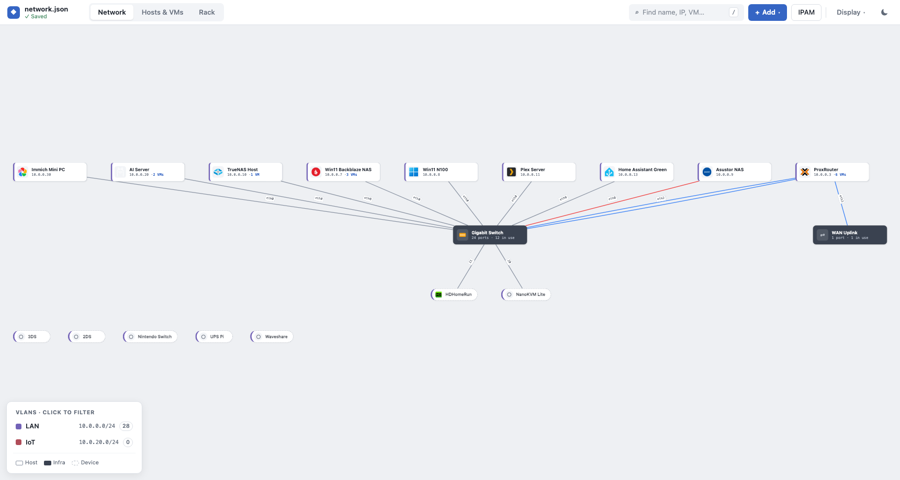
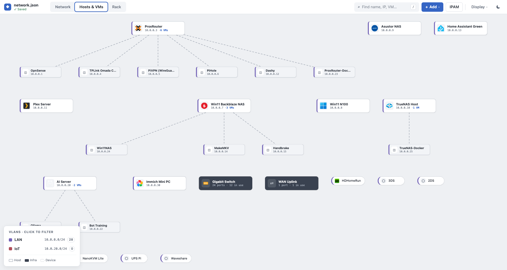
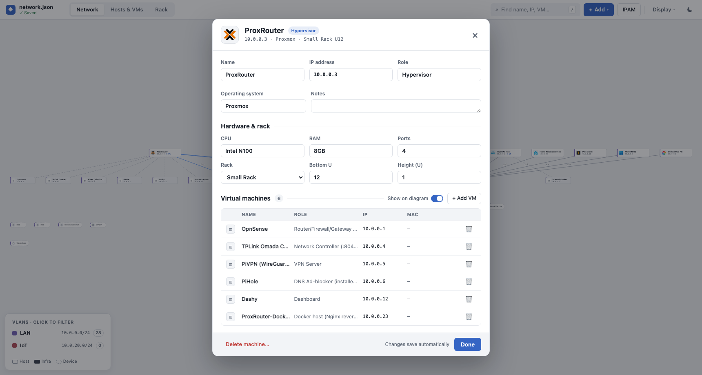
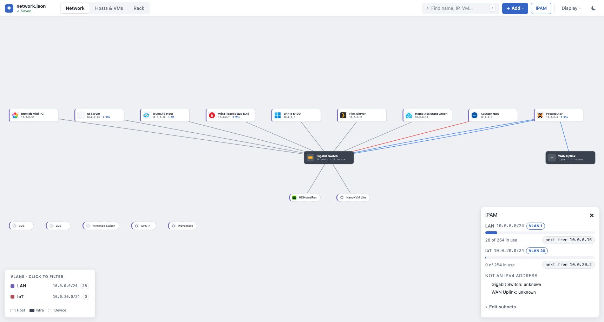
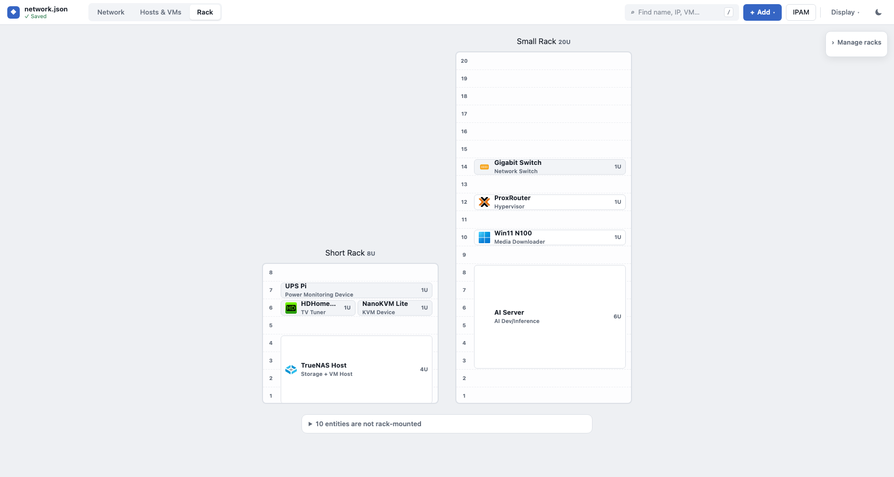
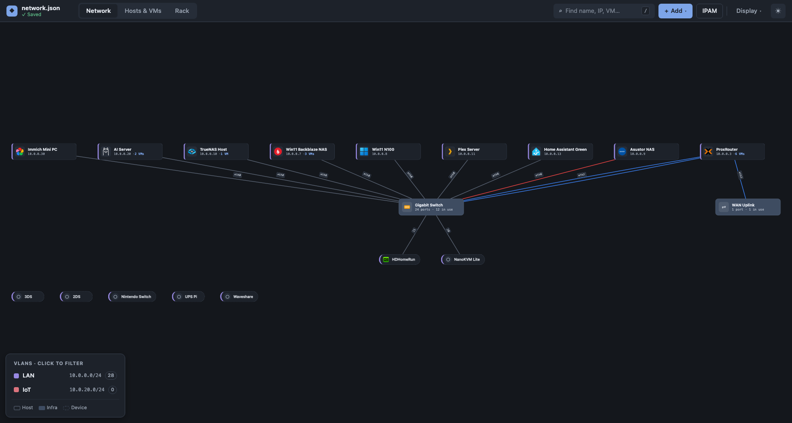

# Open Network Diagram

[](https://hub.docker.com/r/jcreek23/open-network-diagram)
[](https://github.com/jcreek/OpenNetworkDiagram/actions/workflows/release.yml)
[](https://github.com/jcreek/OpenNetworkDiagram/actions/workflows/docker.yml)
[](https://github.com/jcreek/OpenNetworkDiagram/releases)
[](https://opennetworkdiagram.jcreek.co.uk)

**A declarative, self-hosted containerised tool for visualising and managing home lab & network architecture diagrams.**

Open Network Diagram helps you document your infrastructure in a visual UI while keeping a real JSON source of truth you can version, back up, and reuse.

- Homelab-friendly: run it in minutes with Docker.
- Practical: edit in the UI and autosave to `network.json`.
- Declarative: keep your topology in Git if you wish.

[Docker Hub](https://hub.docker.com/r/jcreek23/open-network-diagram) | [Live Demo (Read-Only)](https://opennetworkdiagram.jcreek.co.uk) | [GitHub Releases](https://github.com/jcreek/OpenNetworkDiagram/releases)



## Features

- Network view with ethernet labels to make physical and logical links easy to read.
- Hosts & VMs view for host-first inventory and service mapping.
- Rack view: managed racks with U positions and heights, side-by-side shelf items, and click-through to the editor.
- Node search that highlights matches by name, IP, role or OS and dims everything else.
- IPAM panel: per-subnet utilization, duplicate-IP conflict detection, and next-free-IP suggestions when adding machines, devices or VMs.
- Subnet and VLAN declarations, with nodes colour-coded by VLAN and a clickable legend filter.
- Cable tracking on connections (type, colour, length) with colour-coded links and hover details.
- Expandable VM lists per machine for quick virtualization visibility.
- Modal editor for machines/devices with live diagram updates, notes and MAC address fields.
- JSON-backed persistence with autosave in self-hosted mode.
- Docker-first deployment with writable data volume support.
- Optional read-only mode for public demos and safe sharing.
- Local vendored icon catalog for offline-friendly runtime behavior.

## Why Home Lab Users Use It

- Keep an always-up-to-date map of machines, VMs, and devices.
- Find a free IP and spot duplicate assignments without a spreadsheet.
- Know exactly what's in your rack and where, down to the U.
- Edit quickly through a modal UI instead of hand-editing large diagrams.
- Persist everything to JSON so backups and Git workflows stay simple.
- Stay fully self-hosted with no runtime dependency on external APIs.

## 2-Minute Docker Quick Start

This is the fastest way to run Open Network Diagram for a home lab.

1. Create a local data folder and seed your first `network.json`:

```bash
mkdir -p ond-data
curl -fsSL https://raw.githubusercontent.com/jcreek/OpenNetworkDiagram/main/data/network.json.example -o ond-data/network.json
```

2. Run the published Docker image:

```bash
docker run -d \
  --name open-network-diagram \
  --restart unless-stopped \
  -p 8080:3000 \
  -e NETWORK_DATA_FILE=/app/data/network.json \
  -e NETWORK_BACKUP_DIR=/app/data/.backups \
  -v "$(pwd)/ond-data:/app/data" \
  jcreek23/open-network-diagram:latest
```

3. Open the app at `http://localhost:8080`.

4. Edit your topology in the UI. Changes persist to `ond-data/network.json`.

Useful follow-up commands:

```bash
docker logs -f open-network-diagram
docker stop open-network-diagram
docker rm open-network-diagram
```

## What It Looks Like

| Network view with ethernet labels                                          | Hosts & VMs view with VMs expanded                                          | Modal editing a machine                                          |
| -------------------------------------------------------------------------- | --------------------------------------------------------------------------- | ---------------------------------------------------------------- |
|  |  |  |

| IPAM panel with subnet utilization                                          | Rack view with shelf items                                          | Dark mode                                          |
| --------------------------------------------------------------------------- | ------------------------------------------------------------------- | -------------------------------------------------- |
|  |  |  |

## Docker Compose Option

If you prefer compose:

```yaml
services:
  open-network-diagram:
    image: jcreek23/open-network-diagram:latest
    ports:
      - '8080:3000'
    volumes:
      - ./ond-data:/app/data
    environment:
      NETWORK_DATA_FILE: /app/data/network.json
      NETWORK_BACKUP_DIR: /app/data/.backups
    restart: unless-stopped
```

Start it with:

```bash
docker compose up -d
```

## For Developers

### Local Development

```bash
git clone https://github.com/jcreek/OpenNetworkDiagram.git
cd OpenNetworkDiagram
pnpm install
pnpm run dev
```

App URL: `http://localhost:5173`

### Build Targets

```bash
pnpm run build          # default build
pnpm run build:docker   # Docker/static target
pnpm run build:netlify  # Netlify target (read-only mode)
pnpm run icons:manifest # regenerate local vendor icon manifest
```

### Runtime and Persistence

- API endpoint: `GET/PUT /api/network-data`
- Writes are enabled unless `NETWORK_READ_ONLY=true`
- When writes are unavailable, API responses include `writableReason` for diagnostics.
- Writes are persisted atomically to the configured data file
- Rolling backups are kept in the backup directory (last 5)

Environment variables:

- `NETWORK_READ_ONLY` (default: `false`)
  - Set to `true` to disable writes and force read-only mode.
- `NETWORK_DATA_FILE` (default: `data/network.json`)
  - JSON file path to read/write.
- `NETWORK_BACKUP_DIR` (default: `data/.backups`)
  - Directory for backup files.

### JSON Example

```json
{
	"machines": [
		{
			"machineName": "ProxRouter",
			"ipAddress": "10.0.0.3",
			"role": "Hypervisor",
			"operatingSystem": "Proxmox",
			"notes": "Primary router box.",
			"software": {
				"vms": [
					{
						"name": "OpnSense",
						"role": "Router",
						"ipAddress": "10.0.0.4",
						"macAddress": "bc:24:11:5a:2e:01"
					}
				]
			},
			"hardware": {
				"cpu": "Intel N100",
				"ram": "8GB",
				"networkPorts": 4
			},
			"ports": [
				{
					"portName": "eth0",
					"speedGbps": 1,
					"connectedTo": {
						"device": "Switch",
						"port": "1",
						"cable": { "type": "Cat6", "color": "blue", "lengthM": 1 }
					}
				}
			],
			"rack": { "name": "Lab Rack", "unit": 10 }
		}
	],
	"devices": [
		{
			"name": "Switch",
			"ipAddress": "10.0.0.2",
			"type": "Network Switch",
			"ports": [
				{
					"portName": "1",
					"speedGbps": 1,
					"connectedTo": {
						"device": "ProxRouter",
						"port": "eth0",
						"cable": { "type": "Cat6", "color": "blue", "lengthM": 1 }
					}
				}
			],
			"rack": { "name": "Lab Rack", "unit": 12 }
		}
	],
	"subnets": [{ "cidr": "10.0.0.0/24", "name": "LAN", "vlanId": 1 }],
	"racks": [{ "name": "Lab Rack", "heightU": 12 }]
}
```

Notes on the optional fields:

- `subnets` powers the IPAM panel and VLAN colouring (`vlanId` is optional per subnet).
- `racks` declares rack names and total units for the rack view; machines/devices opt in with a `rack` placement (`unit` is the bottom U, `heightU` defaults to 1). Items with the identical U range render side by side as shelf-mates.
- `cable` on a `connectedTo` records type/colour/length and is kept identical on both ends automatically.
- `notes` (machines and devices) and `macAddress` (ports and VMs) are free text.

### Project Structure

```text
OpenNetworkDiagram/
├── src/                               # Svelte app source
├── src/lib/shared/                    # Schema + persistence core (shared with server.mjs)
├── src/lib/config/vendorIconManifest.ts # Generated local icon catalog
├── static/data/network.json           # Demo dataset (Netlify)
├── static/icons/vendor/               # Vendored icon assets (runtime-local)
├── data/network.json.example          # Starter data template for Docker users
├── third_party/                       # Third-party provenance + licensing
├── Dockerfile                         # Docker build/runtime image
├── server.mjs                         # Node runtime server (static + API)
├── docker-compose.yml                 # Local compose example (build from repo)
├── netlify.toml                       # Netlify build config
└── .github/workflows/                 # CI workflows
```

### CI/CD

- `docker.yml`: validates Docker build on pull requests.
- `release.yml`: semantic release on `main` and Docker Hub publish for tagged releases.
- Docker Hub image: [`jcreek23/open-network-diagram`](https://hub.docker.com/r/jcreek23/open-network-diagram)

## Contributing

1. Fork the repository.
2. Create a feature branch.
3. Commit your changes.
4. Push your branch.
5. Open a pull request.

## License

[GNU GPL v3](LICENSE)
